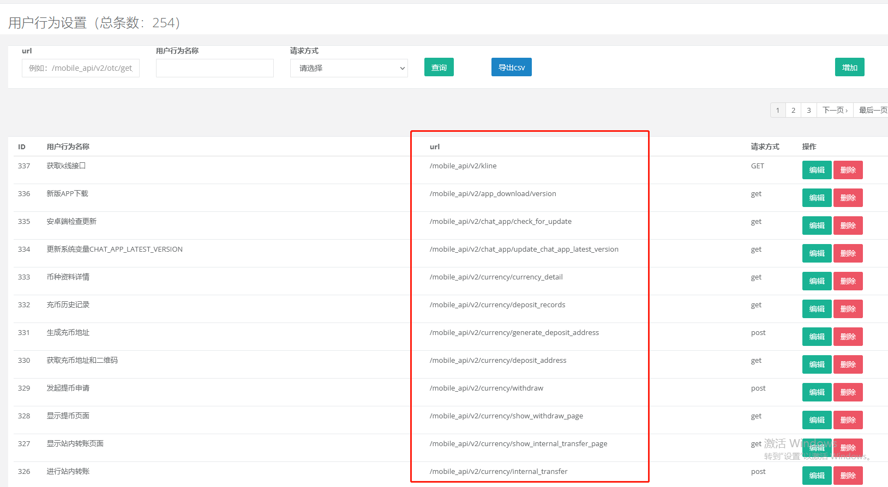

# Banana Waf 管理员端

对于Banana WAF前端，地址在：https://github.com/sg552/banana-waf

Banana Waf是个非常好用的管理员端。可以：

- 查看被封的IP，以及理由
- 查看访问的URL，以及频率
- 查看各种机型（客户端）
- 对IP进行统计，识别哪些是安全IP，哪些是危险IP

## 安装

这是个非常典型的Rails项目，需要：

- ruby 2.7.1
- rails 6.0.3
- MySQL
- Redis

## 启动方式

./restart_very_quickly  具体见脚本内容

## 一些截图

1 列出访问的IP

2 API列表

3 ip分析

4 访问列表

5 设备列表

6 错误登录

7 定义需求

